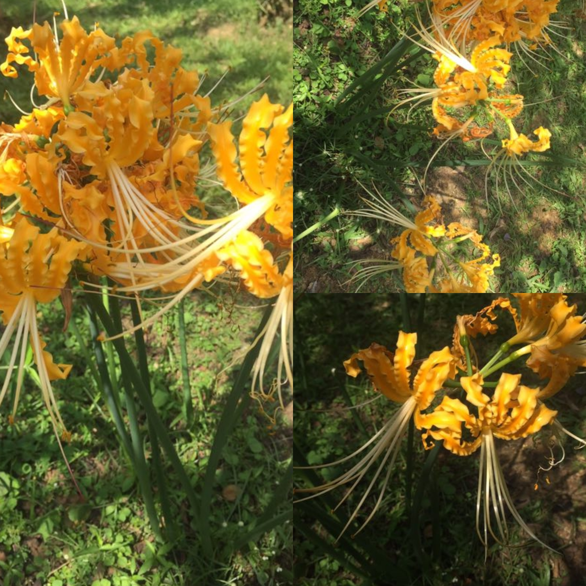
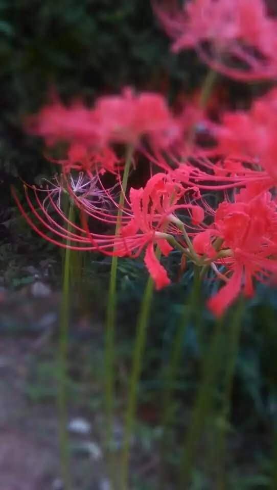
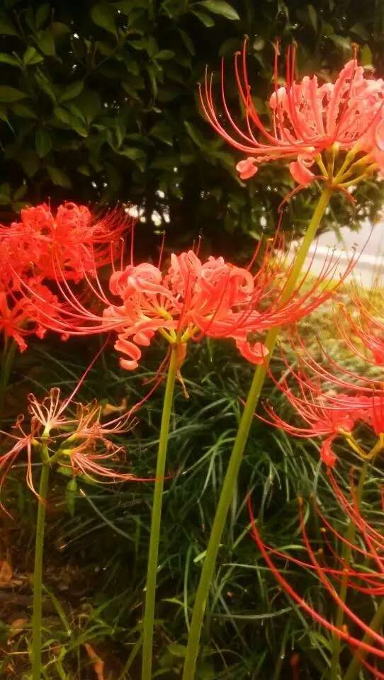
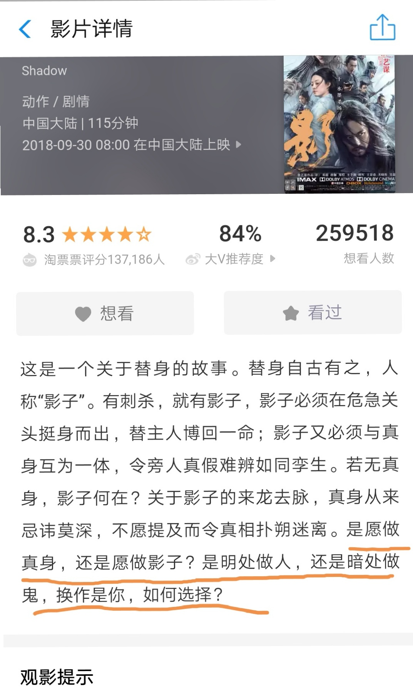

彼岸花
本是青翠绕红蕊，
却道花叶两相隔。
不惜落土护君盛，
唯愿一世生死托。
2018-10-03亚男

@江夏男 严格来说，只要红色的石蒜才能叫彼岸花。

创作来源

第一是看了《影》的介绍，
在思考真身和影子的问题。

第二，我在看线程的时候，发现一个线程操作一个对象的时候，为了能让这个线程很好的操作这个对象，又预置了三个变量来描述这个对象。

第三，我把对象的外在表现，比如描述这个对象本身的成员变量和对这个对象的操作，牵强的看成了，片子中的，真身。
把有关线程操作这个对象的变量描述，看成了替身。

第四，今天的定题诗，彼岸花，是花叶不相见，我也是今天才知道的。
花就像真身，叶就像影子[捂脸][捂脸][捂脸]

创作过程就是这样[抠鼻][抠鼻][抠鼻]

