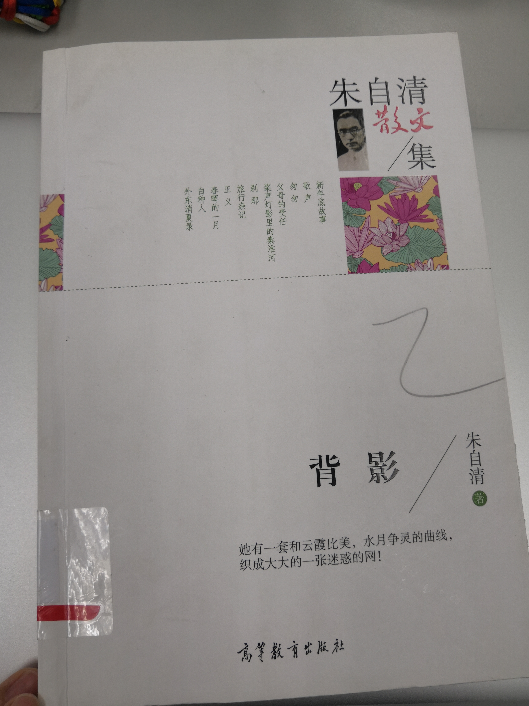
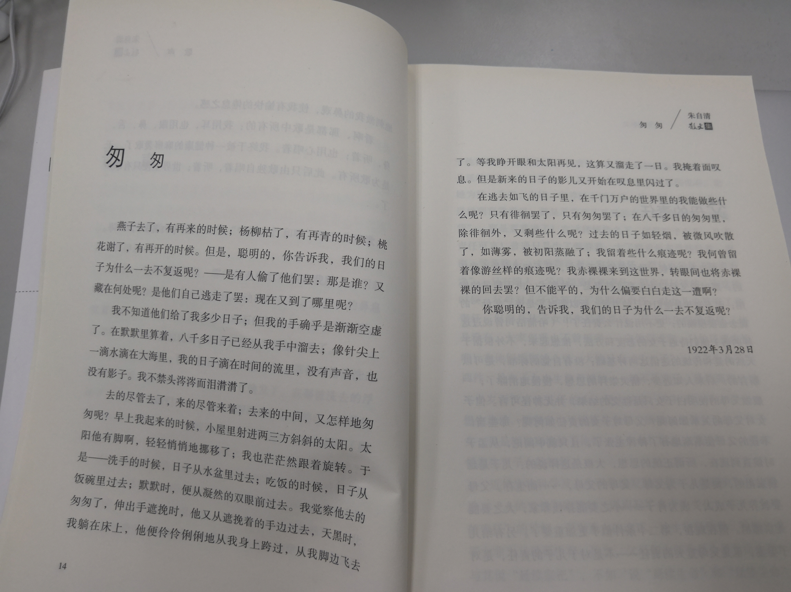

匆匆
朱自清的《匆匆》，写满了时间已过的怅惘和时间未过的叹息。满纸的徘徊，道不尽那如轻烟、如薄雾的日子。在发现赤裸裸来、也必将赤裸裸去的真相后，停驻在为什么要白白走着一遭的疑惑里。

王菲的《匆匆那年》，终于有了对面对匆匆的坦然，不过确是在经历爱别离后，对一段青涩感情在无法回到当初的怀念。
清澈、纯净的嗓音唱出了每个人都是在追求幸福的事实，却也不得不接受，在追求幸福的这条道路上，因为自己的无知与不善巧，带来的生命最美丽的遗憾。或许我们必将要尝试着，以他人能够接受的方式，与他人相处，才能让这个美丽的遗憾，画上一个圆满的句号。

今天也看到榜样(FS)的匆匆 ，匆匆忙忙地去上殿、匆匆忙忙地去扫地、匆匆忙忙地去打坐、匆匆忙忙地去念经，匆匆忙忙地去“过堂”。榜样(FS)在寻找自己的禅堂，修行自己的修行，却在某一天发现：“就这样笨笨地错过了脚下的每一步，任由自己的心外驰到所谓的禅堂”。

匆匆不应是对过去的留不住，也不应是对未来的无可奈何，是在当下的那一刻，找回最初的安稳和从容，觉察当下的忐忑与不适，体会每一个到来之念的真相。

2019-03-10亚男

资料出处：
《匆匆》出自朱自清散文集《背影》高等教育出版社。

《匆匆那年》出自下面音频

你知道属于你的禅堂在哪里吗？(贤书)
 
过去，我会认为只有去坐禅，才叫修行，只有去念经才叫修行，后来，接受了上殿也是修行，扫地也是修行，乃至吃饭也是修行，因为汉传佛教的吃饭被称为“过堂”。
我就匆匆忙忙地去禅堂打坐，匆匆忙忙去上殿，匆匆忙忙去过堂，匆匆忙忙去扫地，匆匆忙忙去念经，等等。
就这样，我“修行”了很长时间。
直到有一天，我匆匆忙忙穿袈裟，赶着去上殿修行，忽然间想观察一下自己的手在干吗？那一刹那，我发现了它，是的，我的手，我称为它，它很陌生，在习惯地穿袈裟，是的，是它自己在穿袈裟。
这个动作，并没有被“我”驱使，也没有得到“我”的许可，也没有向“我”报告。
是它自己在意识习惯的驱使下干的，而且，它自己也不知道自己是在穿袈裟。
后来，我开始注意观察默默这个身体，并且不仅仅是在禅堂、佛堂大殿上、斋堂里，等等。我开始学习适应在一切场合观察，甚至在厕所里，在床上睡觉的时候，在与客人谈话的时候，等等。
然后，我就发现，匆匆忙忙赶去禅堂打坐修行，是一件好搞笑的事情。
我就这样笨笨地错过了脚下的每一步，任由自己的心外驰到所谓的禅堂。事实上，每一个当下，才是我们的禅堂。
其实，您也可以试试，比如，此时此刻，是的，此时此刻，你觉察一下自己拿手机的手，它在干什么，是什么姿势，而不再只是盯着屏幕的文字，然后再觉察一下自己的脚在哪里，再觉察一下自己的身体，牙齿在干什么，脖子是什么姿势，呼吸的速度，等等，对，就这样觉察它们，并且保持一会。
是的，就是这样。
此时，就是你的修行时光，此地，就是你的禅堂。