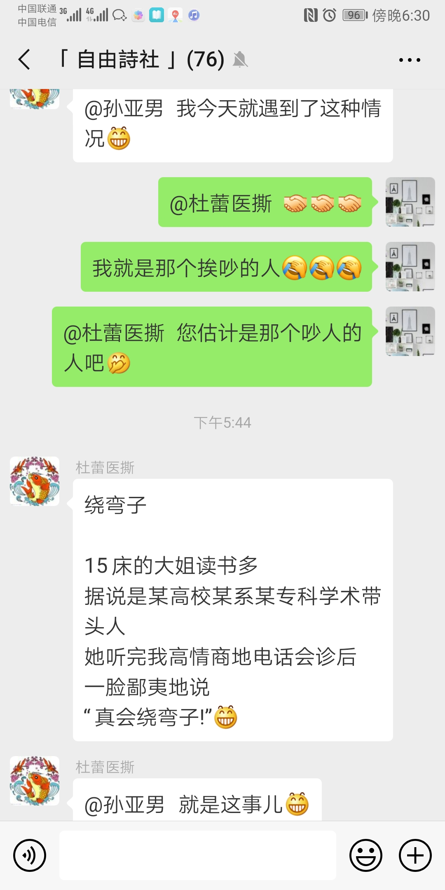

啰嗦的人

有人想问A事，
与A事相近的是B信息点，
与B事相近的是C信息点。
于是他从C信息点开始问起。

领导发现了，
说C是基础常事，为啥还不懂？
弯弯绕绕几回合，
于是A被暴露出来。

啰哩啰嗦的总是提供多余的信息
啰哩啰嗦的总是把别人绕晕
这是有多担心问题本质引发的冲突？
有所偏爱，便有所不自在。
2019-02-20亚男

绕弯子

15床的大姐读书多
据说是某高校某系某专科学术带头人
她听完我高情商地电话会诊后
一脸鄙夷地说
“真会绕弯子!”[呲牙]