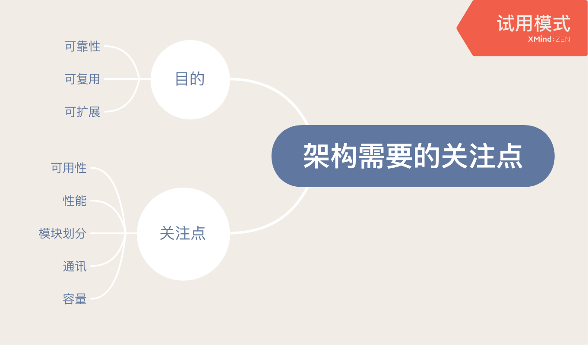
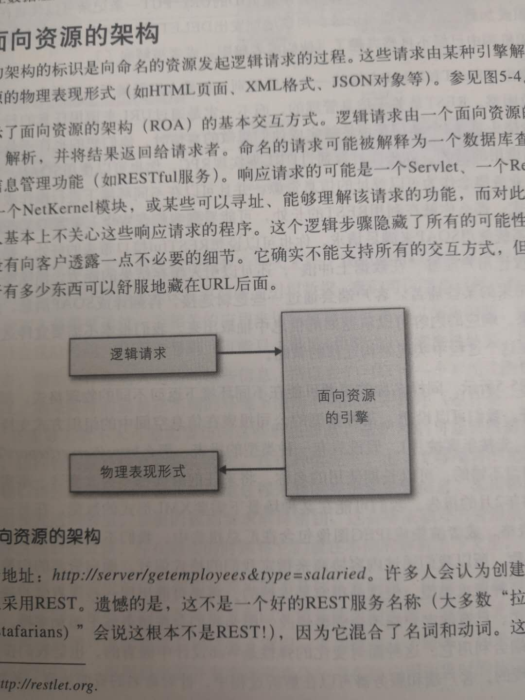

《架构之美》读书笔记
---
title: 《架构之美》读书笔记
date: 2019-05-26 19:23:35
tags:
 - 架构
---

来源：理工图书馆，三层软件编程类（tp311.5-436）
缘起：读《简单之美》时后面的推荐

# 1.架构都需要关注哪些点？

# 2.引用的几个例子
## 游戏
- 1.为每个客户端建立对应的世界。
- 2.保存这个用户对应的世界信息。
- 3.为达到这个世界可以和其他客户端世界相同的目的，建立一个基础公共世界。

## web资源服务
- 1.客户端向服务端发送请求
- 2.关注于数据的整理和表达，属于数据驱动的应用。
- 3.面向资源的引擎。

举例：两个不同的路径可能指向一个数据，这两个路径是代表了不同的上下文的。

## 照相机业务流程
- 1.每个流程会有很多依赖jar包的引用
- 2.分层处理，可以为每个环节创建对应的上下文，数据在不同的环节中流转

总结：
以后若有对应的项目，可以按照这个思路做。我目前处在web资源服务类型应用的构建上。

