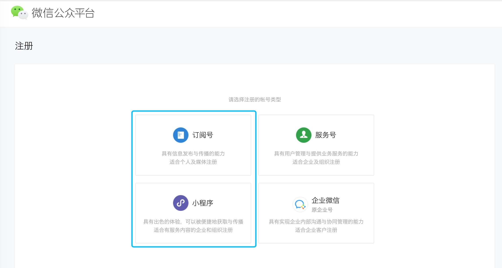
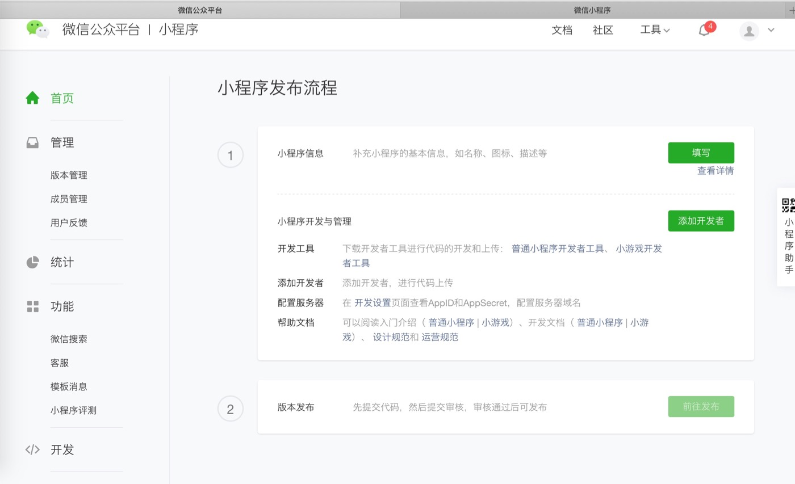
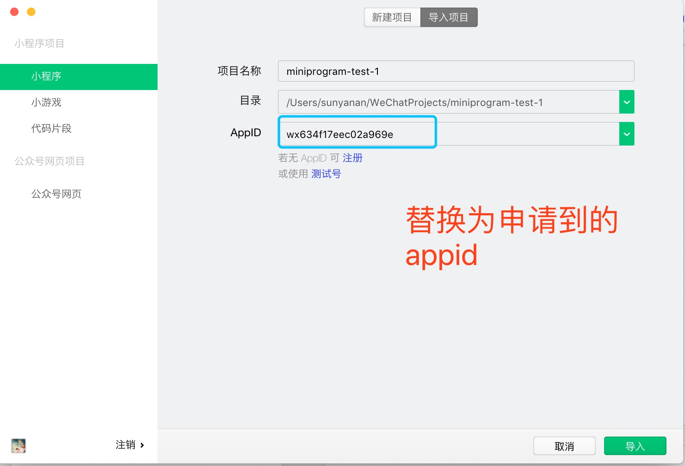
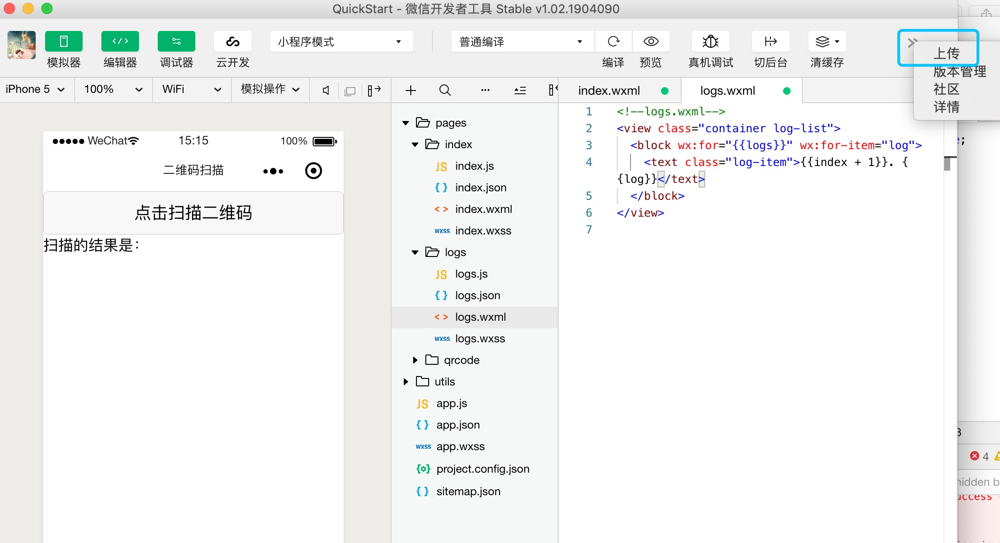

---
title: 微信小程序开发知识点
date: 2019-03-13 19:23:35
tags:
 - 页面展示
 - 二维码扫描
 - 条形码扫描
---


# 目录：
- 1.界面相关的代码写在哪里？
- 2.业务逻辑写在哪里？
- 3.开发完后如何让别人体验这个应用？
- 4.相关项目地址

## 界面相关的代码写在哪里？
小程序创建后，和页面(pages)相关的地方会有四个文件，其中一个文件的后缀名为wxml，在这里可以写我们的页面布局。
- 1.主要使用的控件有view、text、button。
- 2.点击或者页面跳转如何实现？
```
答：-- ①在这些控件上可以设置点击的属性(bindtap)用来控制界面的跳转,值为方法名。在这里跳转到哪里属于逻辑部分，所以相关的代码在另外一个文件中西。
-- ②关于跳转，除了为控件设置点击事件外,还可以使用 navigator 控件。这个控件有一个url的属性，值为要跳转到的界面路径
```
- 3.假如当前页面有列表展示的需求该怎么做？
```
答：每个控件都可以设置 wx:for 属性，值为一个数组或列表。设置后这个控件会被渲染n次。
```
- 4.当前页面有两布局，如何做到满足不同的条件就显示相应的？
```
答：可以给元素使用 wx:if 属性
```
- 5.如何控制界面元素的间距及风格？
```
答：可以在另外一个文件，后缀名wxss中写样式。控件上使用 class 属性，值为wxss文件中对应的名称。
```

## 业务逻辑写在哪里？
业务逻辑有两个地方：一个是整个app，在项目的根目录下有一个后缀名为js的文件；一个是当前页面。在这两个地方，分别有两个对应的函数，app(object obj)，page(object obj)。而这个对象里，可以包含生命周期函数，普通函数，响应界面点击函数，变量的声明也可以放在这里。

如何给变量初始化，和赋值？
- 1.赋值用 setData 方法，且赋值操作不是=，而是:如下
```
  this.setData({
      nameValue: e.detail
    })
```
- 2.如果是在网络请求里，应先把声明一个变量，然后把this赋值给这个变量，赋值的时候，使用这个变量 setData 。

## 开发完后如何让别人体验这个应用？
想让别体验这个应用就需要认识一下appid，有了这个id，就可以把代码上传到小程序对应的微信公众平台。
微信的公众平台我目前比较常用的有两种：一个是大家都知道的公众号，可以进行推文；一个是小程序。
如下图


这个appid是这么来的?
- 1.注册一个服务类型为小程序的账号。
- 2.账号首页，打开后如下图。点击填写，补充小程序的信息

- 3.在界面左侧最后一项设置里，点开后，基本设置选项卡最下面，就会有一个appid。

取到这个appid后，可重新打开项目，在如下图位置，把原来的测试appid，换成申请后的。


打开后，在编辑工具左上角就能看到上传按钮了。


## 相关项目地址
天津检查院
https://gitee.com/tangyouge/newMedia.git

二维码条形码扫描
https://gitee.com/sunyn/barcode_and_qrcode_scanning.git


